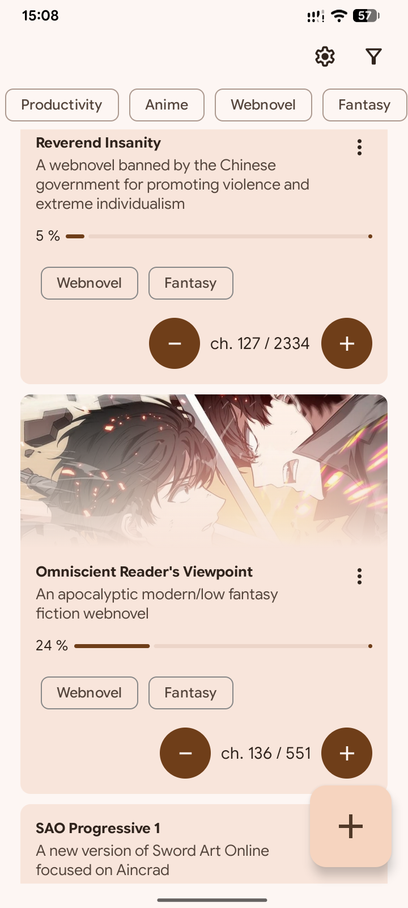
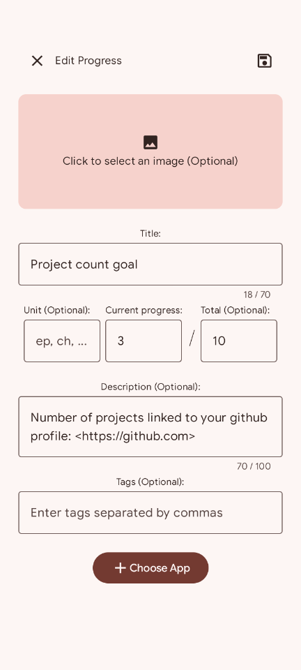
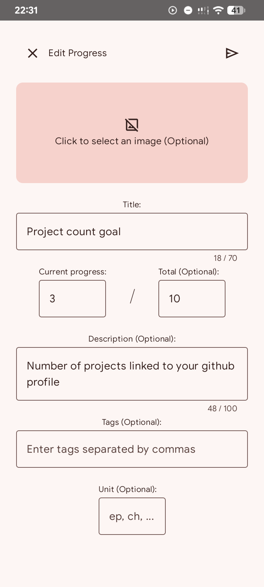
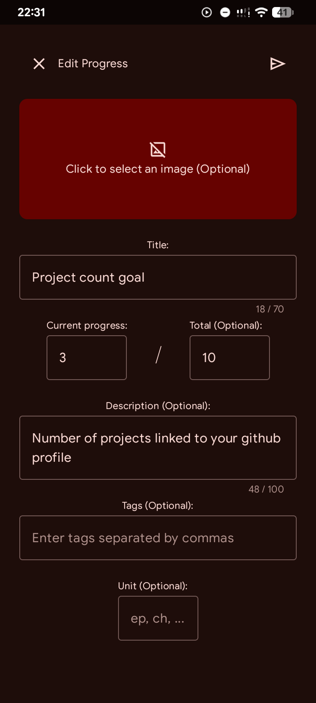

	

<h1 align="center">Pioneer</h1>

	
	
	

A free and open source tool to keep track of progress locally and manage them in one place.

	
	
	
	

## Installation
Get the app from [releases](https://github.com/ki-bun/Pioneer/releases) or from the following app stores:

## Features
- Material 3 dynamic theme and design
- Display tags and images selected from local storage
- Edit and delete progress
- Import and export to CSV
- Annotate links in description by enclosing the url in `<` and `>`
- Filter items based on tags
